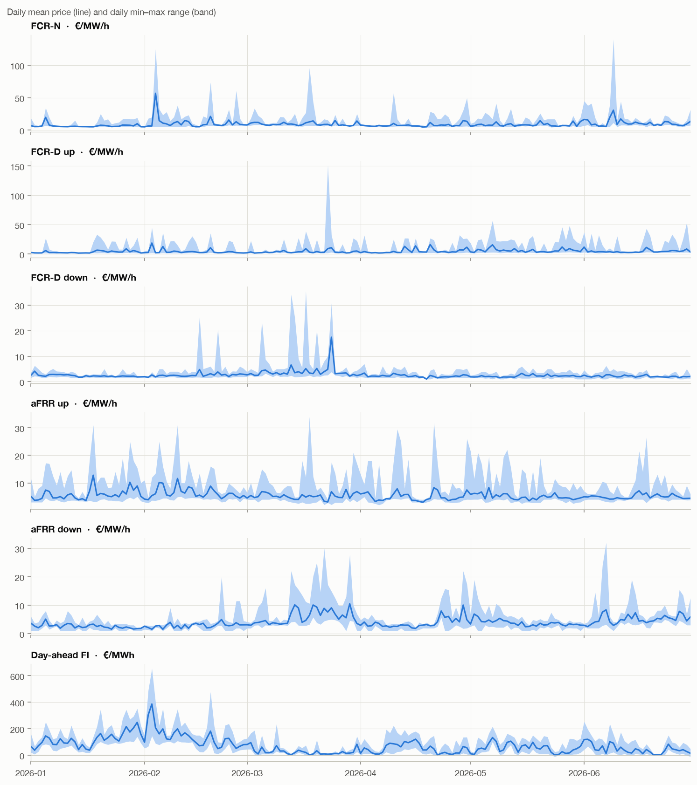
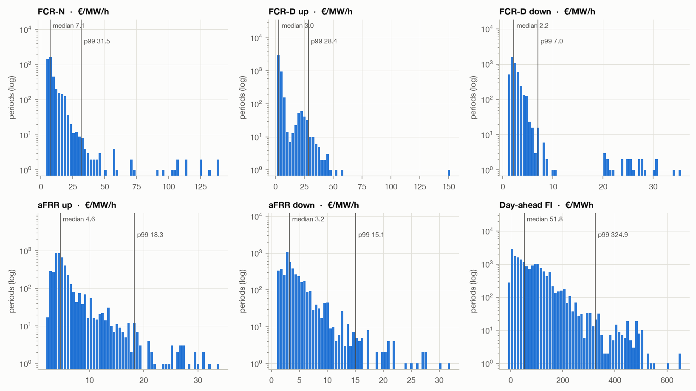
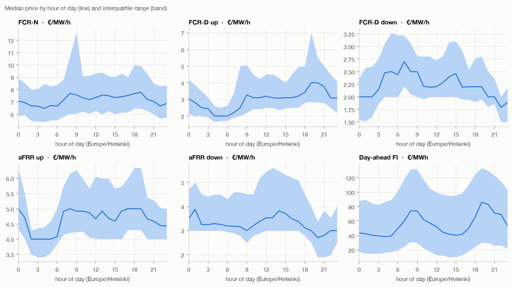
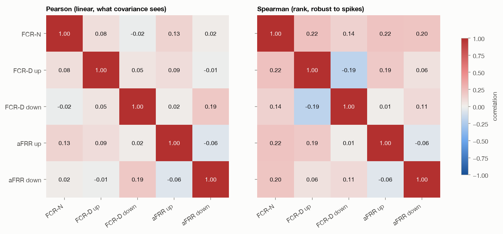

# Raw data overview

Study period **2026-01-01 to 2026-06-30** (inclusive, Europe/Helsinki).
Generated 2026-09-28 11:08 UTC by `scripts/raw_data_report.py` from the files in `data/raw/`.
Regenerate after refetching or changing `config/study.toml`.

Sources: reserve capacity prices from Fingrid open data (datasets listed in
`config/markets.toml`); day-ahead prices from the ENTSO-E Transparency Platform.
Reserve prices are in €/MW/h, day-ahead prices in €/MWh, so the two are not on a
common scale.

## Summary

Statistics use each market's native resolution (1 h for reserves, 15 min for
day-ahead), restricted to the study period. Nothing is resampled or filled.
Machine-readable copy: [summary.csv](summary.csv).

| Metric | FCR-N | FCR-D up | FCR-D down | aFRR up | aFRR down | Day-ahead FI |
|---|---:|---:|---:|---:|---:|---:|
| Unit | €/MW/h | €/MW/h | €/MW/h | €/MW/h | €/MW/h | €/MWh |
| Resolution | 1 h | 1 h | 1 h | 1 h | 1 h | 15 min |
| Rows in period | 4,343 | 4,343 | 4,343 | 4,343 | 4,343 | 17,372 |
| Expected rows | 4,343 | 4,343 | 4,343 | 4,343 | 4,343 | 17,372 |
| Missing periods | 0 | 0 | 0 | 0 | 0 | 0 |
| Duplicate timestamps | 0 | 0 | 0 | 0 | 0 | 0 |
| A03 repeated points | 0 | 0 | 0 | 0 | 0 | 436 |
| Mean | 9.02 | 4.55 | 2.58 | 5.41 | 4.00 | 70.85 |
| Std. deviation | 7.80 | 5.94 | 1.99 | 3.00 | 2.71 | 68.62 |
| Min | 4.10 | 1.30 | 1.00 | 2.00 | 1.00 | -10.92 |
| 5th percentile | 5.10 | 1.60 | 1.50 | 3.00 | 1.00 | 2.27 |
| Median | 7.12 | 3.00 | 2.20 | 4.59 | 3.24 | 51.77 |
| 95th percentile | 18.00 | 19.47 | 4.49 | 11.05 | 9.09 | 191.54 |
| 99th percentile | 31.53 | 28.43 | 7.00 | 18.29 | 15.06 | 324.87 |
| Max | 140.00 | 151.53 | 35.58 | 34.00 | 32.00 | 654.88 |
| Skewness | 9.2 | 6.6 | 9.8 | 3.8 | 3.4 | 2.0 |
| Excess kurtosis | 118.9 | 98.6 | 121.8 | 20.1 | 18.8 | 7.3 |
| Negative prices (% of periods) | 0.0% | 0.0% | 0.0% | 0.0% | 0.0% | 0.9% |
| Autocorrelation, 1 h lag | 0.73 | 0.52 | 0.65 | 0.46 | 0.73 | 0.96 |
| Autocorrelation, 24 h lag | 0.10 | 0.10 | 0.16 | 0.16 | 0.45 | 0.71 |
| Revenue, 1 MW every hour (€/MW) | 39,155 | 19,782 | 11,184 | 23,478 | 17,368 | – |
| Revenue from top 5 % of hours | 18.4% | 29.1% | 14.9% | 14.7% | 16.1% | – |

- **Missing periods** compares the rows present with every period expected in
  the study period at that resolution.
- **A03 repeated points**: prices ENTSO-E omitted because they equal the
  previous point; they take that price, as the format defines.
- **Revenue, 1 MW every hour**: sum of hourly capacity prices, i.e. income from
  selling 1 MW in every hour of the period, ignoring energy activation. Only
  defined for reserve markets.
- **Revenue from top 5 % of hours**: share of that income earned in the 5 %
  highest-priced hours; high values mean income depends on price spikes.

## Figures

### Price over time

### Price distributions

Count axis is logarithmic so rare spikes remain visible.

### Hour-of-day profile

### Correlation between reserve markets

Hourly reserve prices only; day-ahead is left out until the 15-minute to
hourly alignment is decided (BLUEPRINT.md, open decision 5).

